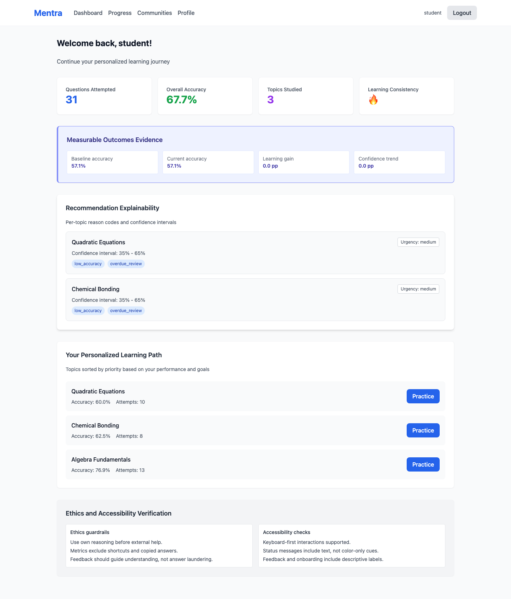
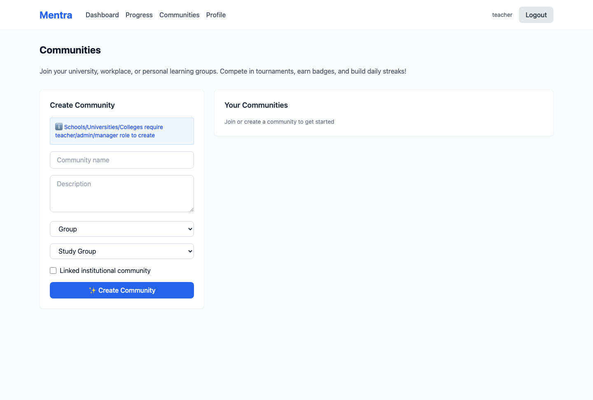
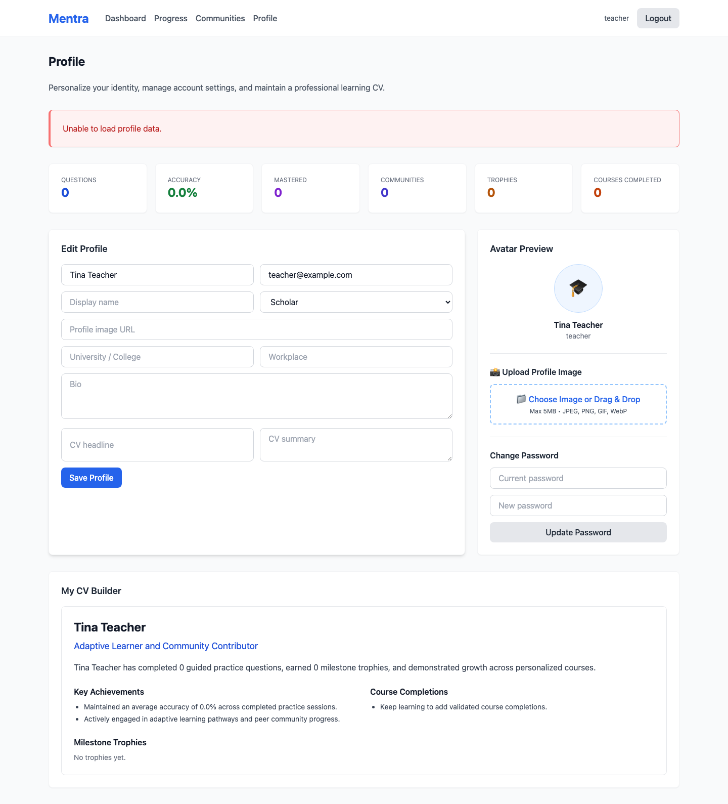
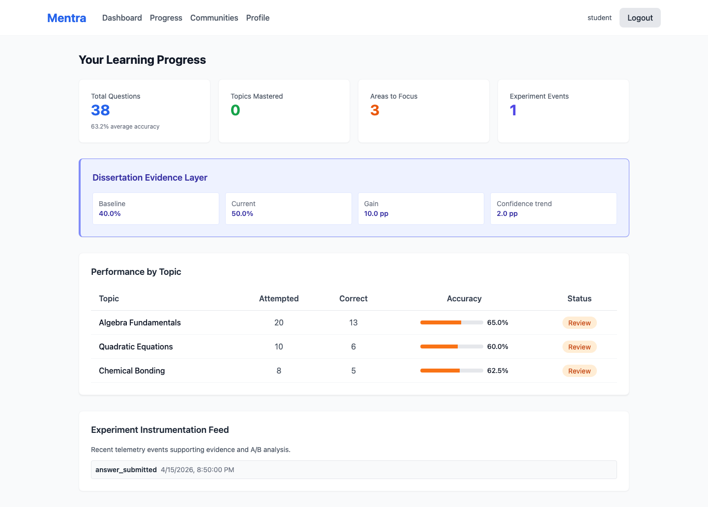
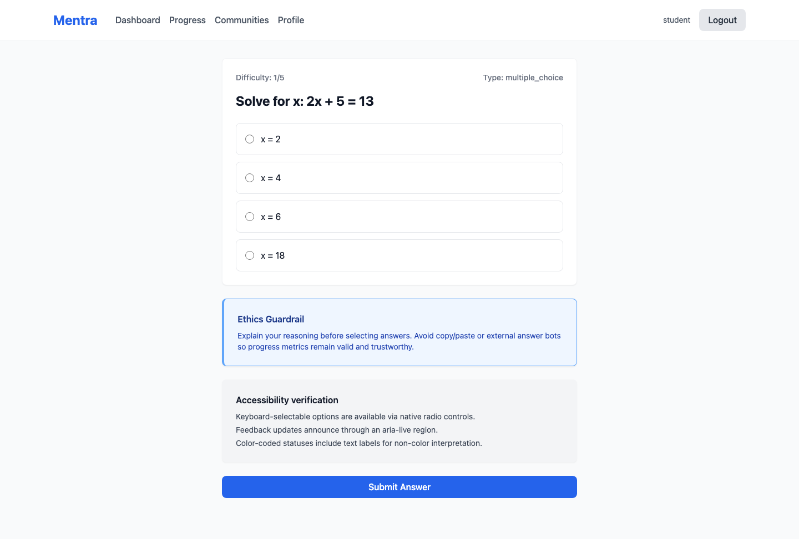
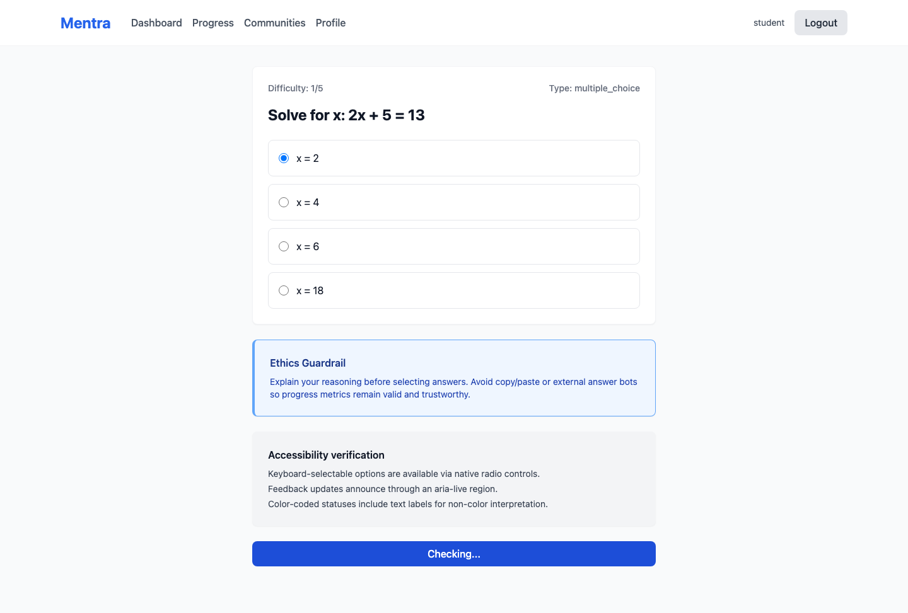

# Mentra - AI-Driven Personal Tutor

An intelligent tutoring system that provides personalized, adaptive, and interactive learning experiences for college/A-Level and undergraduate students.

## Project Overview

Mentra addresses the gap in current e-learning systems by offering:
- **Personalized Learning Guidance**: Adapts to individual learner performance and pace
- **Intelligent Feedback**: Provides step-by-step explanations for incorrect answers
- **Adaptive Content**: Recommends topics to study based on identified weaknesses
- **Progress Tracking**: Visualizes improvement over time to maintain motivation

## Architecture

```
mentra/
├── frontend/          # React TypeScript UI
├── backend/           # Python FastAPI + AI/ML
├── docs/             # Documentation & architecture diagrams
└── docker-compose.yml # Container orchestration
```

## Functional Requirements

| Requirement | Description |
|---|---|
| FR1 | Provide personalized learning guidance based on individual performance |
| FR2 | Deliver step-by-step explanations for incorrect answers |
| FR3 | Recommend topics to study based on identified weaknesses |
| FR4 | Break learning content into manageable sections |
| FR5 | Provide expert-level learning support accessible 24/7 |
| FR6 | Track learner progress and highlight improvement |

## Non-Functional Requirements

- **Usability**: Clear, concise, easy-to-understand feedback
- **Performance**: Immediate feedback delivery (<2 seconds)
- **Availability**: 24/7 accessibility
- **Engagement**: Interactive and visually clear explanations
- **Ethics**: Support learning without encouraging academic dishonesty

## Target Users

1. **Exam-Focused Learners** (A-Level/College, age 17-18)
   - Goal: Achieve strong exam results
   - Need: Guided revision pathways, clear feedback

2. **Independent Learners** (Undergraduate, age 19-21)
   - Goal: Understand concepts efficiently
   - Need: Personalized guidance, adaptive practice

## Tech Stack

- **Frontend**: React, TypeScript, Tailwind CSS, Vite
- **Backend**: Python 3.11+, FastAPI, SQLAlchemy
- **Database**: PostgreSQL
- **AI/NLP**: OpenAI API / LLama integrations
- **Cache**: Redis
- **Auth**: JWT + OAuth2
- **Deployment**: Docker, AWS/Railway

## Quick Start

### Prerequisites
- Node.js 18+ (frontend)
- Python 3.11+ (backend)
- PostgreSQL 14+
- Docker & Docker Compose (optional)

### Backend Setup

```bash
cd backend
python -m venv venv
source venv/bin/activate  # On Windows: venv\Scripts\activate
pip install -r requirements.txt
cp .env.example .env
python -m uvicorn app.main:app --reload
```

### Frontend Setup

```bash
cd frontend
npm install
npm run dev
```

### Docker Setup

```bash
docker-compose up -d
```

### Demo Accounts (Seeded Data)

After running the seed script, these accounts are available:

- `student` or `student@example.com` / `testpass123`
- `caseystudent` or `caseystudent@example.com` / `password123`
- `teacher` or `teacher@example.com` / `testpass123`
- `analyst` or `analyst@example.com` / `testpass123`
- `manager` or `manager@example.com` / `testpass123`
- `admin` or `admin@example.com` / `testpass123`

Frontend signup also sends a signup notification through `formsubmit.co`.
Set `VITE_FORMSUBMIT_ENDPOINT` in `frontend/.env` (for example: `https://formsubmit.co/ajax/your-email@example.com`).

## Getting Started with AI Features

The application now includes AI-powered feedback, spaced repetition, and advanced learning analytics. Follow these steps to test the system:

### 1. Run Test Suite

```bash
cd backend
pytest --cov=app --cov-report=html
```

This runs comprehensive tests for all AI features including:
- LLM feedback generation
- Spaced repetition algorithm
- Session analytics
- Performance prediction

View the coverage report: `open htmlcov/index.html`

### 2. Start Ollama (Local LLM)

```bash
docker run -d -v ollama:/root/.ollama -p 11434:11434 ollama/ollama
docker exec ollama ollama pull neural-chat
```

This starts a containerized Ollama service (no external API keys needed). The `neural-chat` model will be automatically downloaded and loaded.

Verify Ollama is running:
```bash
curl http://localhost:11434/api/generate \
  -d '{"model":"neural-chat","prompt":"Hello!"}'
```

### 3. Start Backend API

```bash
cd backend
uvicorn app.main:app --reload
```

Access the interactive API docs: `http://localhost:8000/docs`

### 4. Test LLM Endpoint

Submit an answer and get AI-powered feedback:

```bash
curl http://localhost:8000/api/questions/submit-answer \
  -X POST \
  -H "Content-Type: application/json" \
  -d '{
    "question_id": 1,
    "user_answer": "4",
    "time_spent": 30,
    "confidence_level": 0.8
  }' \
  -H "Authorization: Bearer YOUR_JWT_TOKEN"
```

Response includes:
- ✅ `is_correct`: Whether answer is correct
- 📝 `explanation`: AI-generated step-by-step explanation
- 💪 `effort_level`: Difficulty assessment (easy/medium/hard)
- 📊 `confidence_feedback`: Confidence level feedback

### 5. Advanced Features

#### Spaced Repetition (Ebbinghaus Curve)
Get topics due for review based on optimal intervals:
```bash
curl http://localhost:8000/api/recommendations/due-for-review/1 \
  -H "Authorization: Bearer YOUR_JWT_TOKEN"
```

#### Performance Prediction
Estimate when user will master a topic:
```bash
curl http://localhost:8000/api/recommendations/mastery-date/1/1 \
  -H "Authorization: Bearer YOUR_JWT_TOKEN"
```

#### Session Analytics
Get learning engagement metrics:
```bash
curl http://localhost:8000/api/recommendations/session-stats/1?days=7 \
  -H "Authorization: Bearer YOUR_JWT_TOKEN"
```

#### Personalized Recommendations
Get ML-powered topic recommendations:
```bash
curl http://localhost:8000/api/recommendations/personalized/1?limit=5 \
  -H "Authorization: Bearer YOUR_JWT_TOKEN"
```

## Features

### ✅ Implemented
- **AI-Powered Feedback**: LLM-generated explanations (local Ollama, no external APIs)
- **Spaced Repetition**: Ebbinghaus curve with [1, 3, 7, 14, 30, 60, 120] day intervals
- **Performance Prediction**: Estimates days to mastery per topic
- **Session Analytics**: Engagement tracking (streaks, consistency, peak hours)
- **Confidence Scoring**: Tracks user self-reported confidence
- **Adaptive Questioning**: Questions adjust to user performance level
- **Progress Tracking**: Visual progress across topics
- **User Authentication**: JWT-based auth with password hashing

## App Screenshots

These screenshots were captured from a working local run using seeded demo data and Playwright automation.

Quick refresh: April 2026 capture pass for dissertation-focused UI (evidence, explainability, guardrails, and transparency).

## Demo Video

Playwright login + app usage walkthrough (MP4):

- [Watch the demo video](docs/media/playwright-video/recorded-video.mp4)

### 1) Login


### 2) Dashboard (Evidence + Explainability)



### 3) Communities



### 4) Profile



### 5) Progress (Evidence + Instrumentation)



### 6) Learning (Guardrail State)



### 7) Learning (Feedback Transparency + Rubric)



### Testing
- **Unit Tests**: 100+ test methods for all services
- **Integration Tests**: API endpoint testing framework
- **Test Fixtures**: Complete in-memory test database
- **Coverage Reports**: Run `pytest --cov=app --cov-report=html`

## Development Phases

**Phase 1**: Project scaffolding & database schema
**Phase 2**: Core API endpoints & authentication
**Phase 3**: Frontend UI components
**Phase 4**: AI/ML personalization engine
**Phase 5**: Integration & testing
**Phase 6**: Deployment & optimization

## Project Status

Starting Phase 1: Project scaffolding

## Contributing

This is a classroom project. All code must follow ethics guidelines and support genuine learning.

## Author

Abokar Mohamed (K2336443)

## License

Proprietary - Kingston University Final Year Project

## References

- Holmes et al. (2019) - Artificial Intelligence in Education
- OpenAI (2023) - ChatGPT & Language Models
- Luckin et al. (2016) - Intelligence Unleashed
